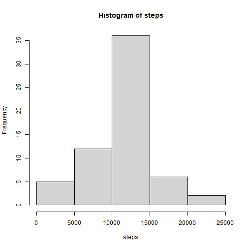

# "Reproducible Research: Peer Assessment 1"


## Loading and preprocessing the data


```r
library(dplyr)

activity <- read.csv("activity.csv",header = TRUE)
activity$date <- as.Date(activity$date,"%Y-%m-%d")
```

## What is mean total number of steps taken per day?

### Histogram


```r
activity_daily <- tapply(activity$steps, activity$date, sum)

hist(activity_daily, xlab= "Total Daily Steps", 
     main = "Total Number of Steps Taken Each Day")
```


### Mean and Median


```r
mean_activity <- mean(activity_daily, na.rm = TRUE)
median_activity <- median(activity_daily, na.rm = TRUE)
```

* Mean: 1.0766189 &times; 10<sup>4</sup>
* Median:  10765


## What is the average daily activity pattern?

### Time Series Plot


```r
avg_act<- activity %>% group_by(interval) %>% 
  summarise(avg_steps=mean(steps, na.rm=TRUE))

with(avg_act, plot(interval,avg_steps,xlab= "Interval", 
                   ylab= "Average Steps",type="l"))
```


### Interval with Maximum Steps


```r
maximum_steps <- avg_act[which.max(avg_act$avg_steps),]
max_interval <- maximum_steps[1]
```

* Most Steps at: 835

## Imputing missing values

### Total Missing Values


```r
missing_values <- sum(is.na(activity$steps))
```
* Total Missing Values : 2304

### Fill in missing values with interval mean


```r
activity_filled <- activity

NAs<-is.na(activity_filled$steps)

avg_int <- tapply(activity_filled$steps, activity_filled$interval, 
                  mean, na.rm=TRUE, simplify=TRUE)

activity_filled$steps[NAs]<- avg_int[as.character(activity_filled$int[NAs])]
```

### Histogram, Median, and Mean of Total Steps Taken with Filled Data Frame


```r
full_steps <- activity_filled %>% filter(!is.na(steps)) %>% 
  group_by(date) %>%
  summarize(steps = sum(steps))

with(full_steps, hist(steps))
```



```r
mean_steps <- mean(full_steps$steps, na.rm = TRUE)
median_steps <- median(full_steps$steps, na.rm = TRUE)
```

* Imputed Mean: 1.0766189 &times; 10<sup>4</sup>
* Imputed Median: 1.0766189 &times; 10<sup>4</sup>

## Are there differences in activity patterns between weekdays and weekends?

### Weekday/Weekend Variable


```r
activity_filled <- mutate(activity_filled, 
                        day_type = ifelse(weekdays(activity_filled$date)=="Saturday"|
                                            weekdays(activity_filled$date)=="Sunday","weekend","weekday"))
activity_filled$day_type <- as.factor(activity_filled$day_type)
```

### Panel Plot


```r
weekday_steps <- activity_filled %>% 
  filter(!is.na(steps) & day_type=="weekday") %>% 
  group_by(interval) %>%
  summarize(steps = mean(steps))

weekend_steps <- activity_filled %>% 
  filter(!is.na(steps) & day_type=="weekend") %>% 
  group_by(interval) %>%
  summarize(steps = mean(steps))

par(mfrow=c(2,1))

with(weekday_steps, plot(interval, steps, xlab ="Interval", ylab= "Steps",
                         main= "Weekday", type = "l"))
with(weekend_steps, plot(interval, steps, xlab ="Interval", ylab= "Steps",
                         main= "Weekend", type = "l"))
```


